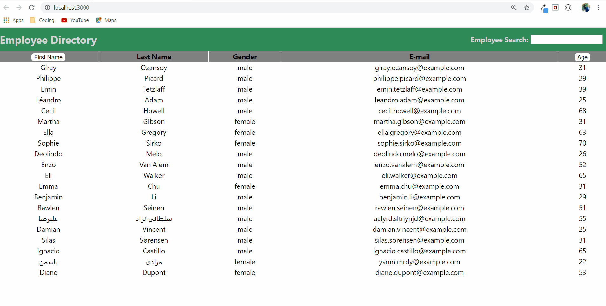

# employeeDirectory
This repository ("employeeDirectory") is an application that gives business management the option to view the complete list of employeees. Additionally, it allows management to search by age or first name to find a specific employee. This web application could be very useful at a larger company with many employees. 

## Installation

The application is deployed using github and heroku. The main page can be opened in the browser. The user will be presented with a database of employees, and will then have search functionality. 

## User Story
**As a** manager of a large company\
**I want** to be able to view specific employees\
**So that** I can access their emails easily  

## Built With
[React.js](https://reactjs.org/docs/getting-started.html) -Backend development language\
[Bootstrap](https://getbootstrap.com/docs/4.1/getting-started/introduction/) -Page rendering template\
[JavaScript](https://developer.mozilla.org/en-US/docs/Web/JavaScript) -Frontend development language and server usage\
[Heroku](https://devcenter.heroku.com/categories/reference) -App deployment using github master branch\

## Credits

I was the creator of the main application and repository. For help when facing obstacles I leaned on my friend Blake, and my friend Chris. Blake is a programmer with 7+ years in the business, and Chris is a work friend who is a fantastic problem solver. I also used YouTube to find different videos on React, JSX, JavaScript, Node.js, routes,and various troubleshooting tips. 

